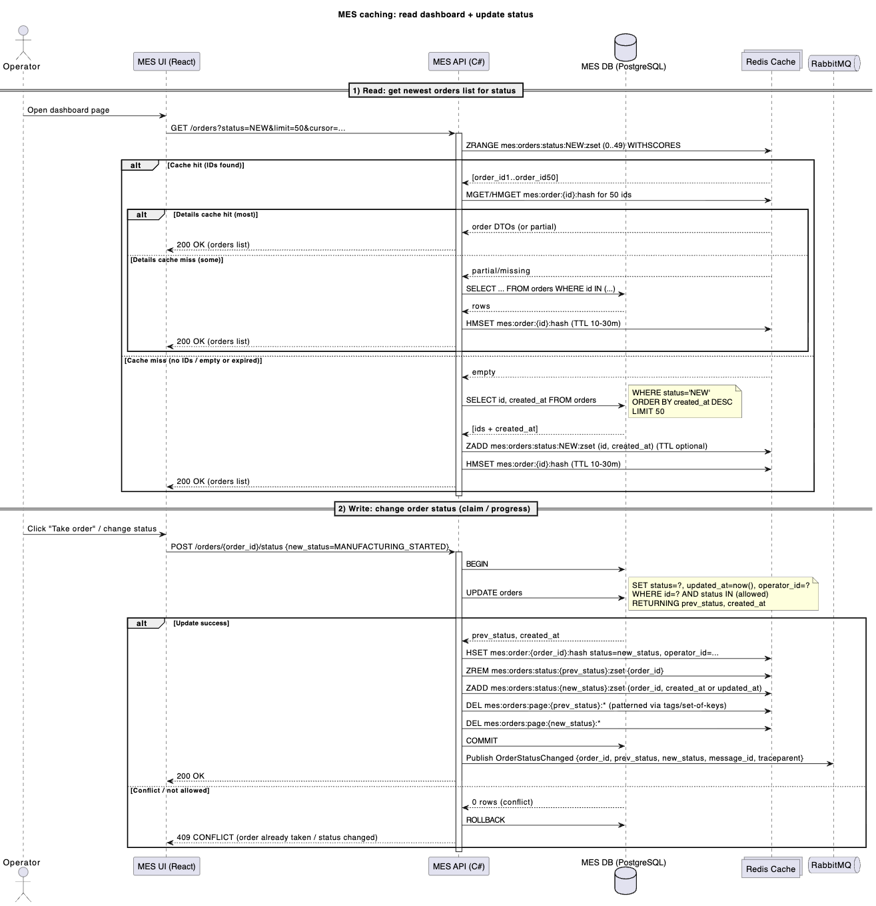

# Архитектурное решение по кешированию

## 1) Что именно имеет смысл кешировать

По кейсу есть две “боли”, которые кеширование может реально разгрузить:

1) **MES: первая страница (дашборд “заказы в работе”)**  
   Операторам важно быстро видеть **самые новые** заказы и фильтровать по статусам.  
   Сейчас даже фильтр + пагинация не спасли → значит, чтение “списка” и агрегаций по статусам стало слишком тяжёлым для MES API + MES DB.

2) **MES: расчёт стоимости (PRICE_CALCULATED)** *(вторым приоритетом)*  
   Он CPU-heavy и длительный (2–3 минуты, иногда до 30). Кеширование результата по “отпечатку” 3D-модели может снизить повторные расчёты, если модели/шаблоны часто повторяются (особенно в конструкторе).

В рамках Task5 фокус — **ускорить чтение списка заказов** и **аккуратно поддерживать консистентность при смене статусов**. Про кеш расчётов — как доп. пункт.

---

## 2) Мотивация

### Почему кеширование нужно
- **Снизить нагрузку на MES DB и ускорить дашборд.**  
  При росте числа заказов тяжёлые запросы “по статусам + сортировка по новым” начинают деградировать нелинейно.
- **Сделать скорость интерфейса независимой от объёма исторических данных.**  
  Операторам нужны “свежие” заказы, а не перебор всей таблицы.
- **Уменьшить задержки в работе операторов → уменьшить просрочку заказов.**  
  Чем быстрее оператор видит новые заказы и берёт их в работу, тем меньше срок.

### Какие проблемы решаем
- Долгая загрузка первой страницы MES.
- Рост нагрузки на MES DB при увеличении количества заказов.
- Пики активности операторов (утро/смена) вызывают “шторм” чтений.

### Что включаем в кеширование
- **Список ID заказов по статусам, отсортированный по времени создания (newest first).**
- **Короткоживущий кеш “страниц” для самых популярных запросов** (status + page/cursor).
- **Кеш деталей заказа** (часто повторно читаемые поля для карточки/строки в списке).

*(Опционально, этап 2)*  
- **Кеш результата расчёта цены по model_hash** (если реально есть повторяемость).

---

## 3) Предлагаемое решение

### 3.1. Тип кеширования: серверное
Выбираем **серверное кеширование** (на стороне MES API), потому что:
- клиентское кеширование (в браузере) не уменьшит нагрузку на MES DB при одновременных операторах;
- серверный кеш даёт общий эффект: одна “тяжёлая” выборка/агрегация → многим пользователям.

Технология: **Redis** (managed или self-hosted) как in-memory store.

### 3.2. Паттерн: Cache-Aside + программная инвалидация (гибрид)
**Для чтения списка заказов** используем **Cache-Aside**:
- если кеш есть → отдаём быстро;
- если нет → читаем из БД, кладём в кеш, отдаём.

**Для записи (смены статуса)** используем “write-around + update cache”:
- пишем статус в БД (источник истины),
- затем **обновляем/инвалидируем** кеши, связанные со списками и деталями.

Почему не чистый Write-Through:
- Write-Through требует гарантированного “синхронного” обновления кеша при каждой записи и усложняет обработку ошибок (если Redis недоступен, что делать?).
- Нам важнее надёжно зафиксировать статус в БД, а кеш — ускоритель (может быть восстановлен).

Почему не только Refresh-Ahead:
- Refresh-Ahead хорош для прогнозируемых ключей, но здесь ключи завязаны на действия операторов и смену статусов.  
  Мы можем добавить refresh-ahead позже на “горячие” списки (например, NEW/IN_PROGRESS), но базово проще и дешевле: cache-aside + инвалидация.

---

## 3.3. Структуры кеша (ключи)

### Кеш “индекса” по статусу (основа)
Храним для каждого статуса отсортированный набор ID (самые новые сверху):

- `mes:orders:status:{STATUS}:zset` → **Sorted Set**  
  score = `created_at_epoch_ms` (или `updated_at_epoch_ms`, если нужно показывать “самые недавно изменённые”)

Это позволяет быстро получить “первые N” заказов по статусу без тяжёлой сортировки в БД.

### Кеш деталей заказа
- `mes:order:{order_id}:hash` → **Hash/JSON** с полями, нужными в списке/карточке  
  TTL: например 10–30 минут (или без TTL, если обновляем на записи; но TTL как страховка)

### Кеш страниц/выборок (опционально)
Если нужен ещё более быстрый ответ на “самый частый запрос”:
- `mes:orders:page:{STATUS}:{cursor_or_page}:{page_size}` → список order_id (TTL 10–30 секунд)

---

## 3.4. Диаграмма последовательности

---

## 3.5. Стратегия инвалидации кеша

Выбираем **гибрид**:
- **Программная инвалидация/обновление по ключу** при изменении статуса заказа (write-path).  
  Это даёт свежесть данных на дашборде (операторам важна актуальность).
- **Короткий TTL** для “страничных” ключей (если используем), например 10–30 секунд.  
  Это страховка от рассинхрона и снижает стоимость точной инвалидации “всех возможных страниц”.

### Почему это подходит
- Статусы меняются относительно часто, а список “самые новые” критичен.
- Обновление `zset` по статусам точечно и дёшево: `ZREM + ZADD`.
- TTL на деталях заказа защищает от долгоживущих “грязных” данных, если пропустили обновление.

### Почему другие стратегии хуже
Ниже сравнительная таблица.

| Стратегия | Плюсы | Минусы | Итог |
|---|---|---|---|
| Только TTL (временная) | Самая простая, почти без кода | Данные могут быть устаревшими до TTL; операторы видят “не то”; конфликт при “кто взял заказ” | Не подходит как основная |
| Инвалидация по ключу (программная) | Данные актуальны почти сразу; минимальный лаг | Нужно аккуратно управлять ключами (особенно “страницами”) | **Основа решения** |
| Refresh-Ahead | Хорошо для “горячих” ключей, снижает промахи кеша | Сложнее, риск лишней нагрузки, нужно предсказывать ключи/частоту | Можно добавить позже точечно |
| Write-Through | Всегда консистентный кеш при успешной записи | Усложняет ошибки (Redis недоступен), повышает время записи | Не берём как базу |

---

## 4) Риски и компромиссы

1) **Консистентность кеша**
- Если Redis временно недоступен, кеш может отставать.
- Решение: БД остаётся источником истины, кеш восстанавливается “на чтении”; TTL — страховка.

2) **Сложность “страничного кеша”**
- Инвалидировать все варианты фильтров/пагинации сложно.
- Решение: либо не кешировать страницы вообще (только индекс + детали), либо держать страницы с коротким TTL.

3) **Горячие ключи**
- Статус “NEW” может быть очень горячим.
- Решение: использовать Redis как sorted set (операция O(logN)), держать limit, при необходимости — шардирование/кластер.

